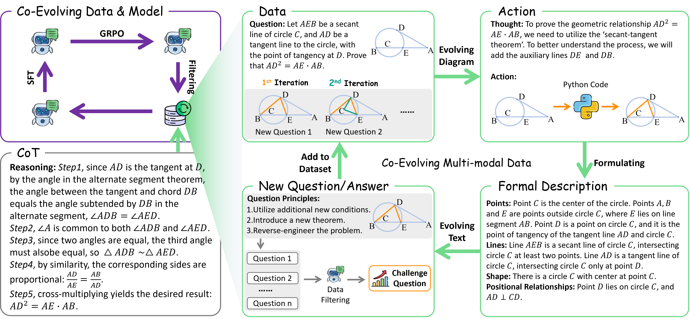

<p align="center">
  <h1 align="center">C2-Evo: Co-Evolving Multimodal Data and Model for Self-Improving Reasoning</h1>
  <p align="center">
    arXiv 2025
  </p>
  <p align="center">
    <a href="https://miicheyang.github.io">Xiuwei Chen</a>,
    <a href="https://transmamba.github.io/" target="_blank">Wentao Hu</a>, 
    <a href="https://transmamba.github.io/" target="_blank">Hanhui Li</a>, 
    <a href="https://transmamba.github.io/" target="_blank">Jun Zhou</a>, 
    <a href="https://transmamba.github.io/" target="_blank">Zisheng Chen</a>, 
    <a href="https://transmamba.github.io/" target="_blank">Meng Cao</a>, 
    <a href="https://transmamba.github.io/" target="_blank">Yihan Zeng</a>, 
    <a href="https://transmamba.github.io/" target="_blank">Kui Zhang</a>, 
    <a href="https://transmamba.github.io/" target="_blank">Yujie Yuan</a>, 
    <a href="https://transmamba.github.io/" target="_blank">Jianhua Han</a>, 
    <a href="https://transmamba.github.io/" target="_blank">Hang Xu</a>, 
    <a href="https://transmamba.github.io/" target="_blank">Xiaodan Liang</a>
  </p>
  <p align="center">
    <a href="https://arxiv.org/abs/2507.16518">
      
    </a>
    <a href='https://c2-evo.github.io/' style='padding-left: 0.5rem;'>
      
    </a>
  </p>
</p>


We propose propose C2-Evo, an automatic, closed-loop self-improving framework that jointly evolves both training data and model capabilities. 

<p align="center">
    
</p>

<br>

<!-- TABLE OF CONTENTS -->
<details open="open" style='padding: 10px; border-radius:5px 30px 30px 5px; border-style: solid; border-width: 1px;'>
  <summary>Tabel of Contents</summary>
  <ol>
    <li>
      <a href="#installation">Installation</a>
    </li>
    <li>
      <a href="#data-preparation">Data Preparation</a>
    </li>
    <li>
      <a href="#training">Training</a>
    </li>
    <li>
      <a href="#inference">Inference</a>
    </li>
    <li>
      <a href="#citation">Citation</a>
    </li>
    <li>
      <a href="#acknowledgement">Acknowledgement</a>
    </li>
  </ol>
</details>

## News
- [2025-12-08] We have released our code. 🔦
- [2025-07-29] Our paper is now accessible at [https://arxiv.org/pdf/2502.15130](https://arxiv.org/pdf/2507.16518)! 

## Installation
Create a conda environment and install the required packages:

**Image Classification**
```bash
conda create -n transmamba-imagenet python=3.9
conda activate transmamba-imagenet

git clone https://github.com/chen-xw/TransMamba-main.git
cd TransMamba-main
pip install -r requirements.txt
pip install -e causal_conv1d>=1.1.0
pip install -e mamba-1p1p1
```


## Data Preparation
- Download **ImageNet-1K** from the [official website](https://www.image-net.org/).
- Download **CIFAR-10/CIFAR-100** from the [official website](https://www.cs.toronto.edu/~kriz/cifar.html).
- Download **LLaVA-Data** from the [official website](https://github.com/haotian-liu/LLaVA?tab=readme-ov-file).
- Download **LLaVA-COT-100K** from the [official website](https://github.com/PKU-YuanGroup/LLaVA-CoT).

## Training

**Training and Inference on Image Classification**
```bash
python  main.py \
  --model-type 'PlainMamba' \
  --model-teacher 'deit_tiny_patch16_224' \
  --distillation-type 'soft' \
  --output_dir 'output/' \
  --epochs 300 \
  --batch-size 256
```

**Training on VQA**
```bash
bash worker/SFT_LLaVA_Mamba_Distill.sh
```

## Inference

Our evaluation is based on [`lmms-eval`](https://github.com/EvolvingLMMs-Lab/lmms-eval)


## Citation
If you find our work useful, please consider citing: 

```bibtex
@article{chen2025c2evocoevolvingmultimodaldata,
      title={C2-Evo: Co-Evolving Multimodal Data and Model for Self-Improving Reasoning}, 
      author={Xiuwei Chen and Wentao Hu and Hanhui Li and Jun Zhou and Zisheng Chen and Meng Cao and Yihan Zeng and Kui Zhang and Yu-Jie Yuan and Jianhua Han and Hang Xu and Xiaodan Liang},
      year={2025},
      eprint={2507.16518},
      archivePrefix={arXiv},
      primaryClass={cs.CV},
      url={https://arxiv.org/abs/2507.16518}, 
}
}
```

## Acknowledgement
We would like to thank the following works for their code and models:
- Training: [LLaVA](https://github.com/haotian-liu/LLaVA?tab=readme-ov-file)

