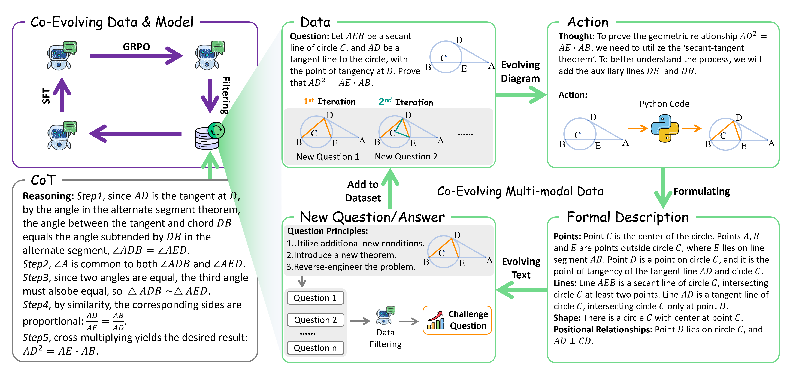

# C2-Evo

[[Paper]](https://www.arxiv.org/abs/)

<div align="center">
  
</div>

This is the homepage for the code release for the preprint "C2-Evo: Co-Evolving Multimodal Data and Model for Self-Improving Reasoning"

Please refer to our paper (linked above) for more details.

## Release Progress

- [ ] C2-Evo training code
- [ ] Evaluation code for C2-Evo
- [ ] Trained model checkpoints and data
- [ ] ...

## Contact

Please email Xiuwei (`chenxw83@mail2.sysu.edu.cn`) if you have any questions.
You can also open a GitHub issue if you encounter any bugs or problems.

## Citation

If you use this code in your research, please cite our paper:

```bibtex
@misc{bhaskar2025cache,
    title={C2-Evo: Co-Evolving Multimodal Data and Model for Self-Improving Reasoning}, 
    author={Xiuwei Chen, Wentao Hu, Hanhui Li, Jun Zhou, Zisheng Chen, Meng Cao, Yihan Zeng, Kui Zhang, Yu-jie Yuan, Jianhua Han, Hang Xu, Xiaodan Liang},
    journal={arXiv preprint arXiv:},
    year={2025}
}
```
